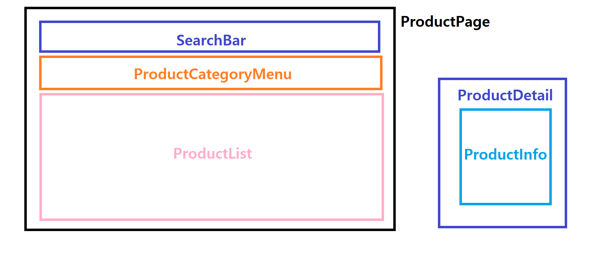
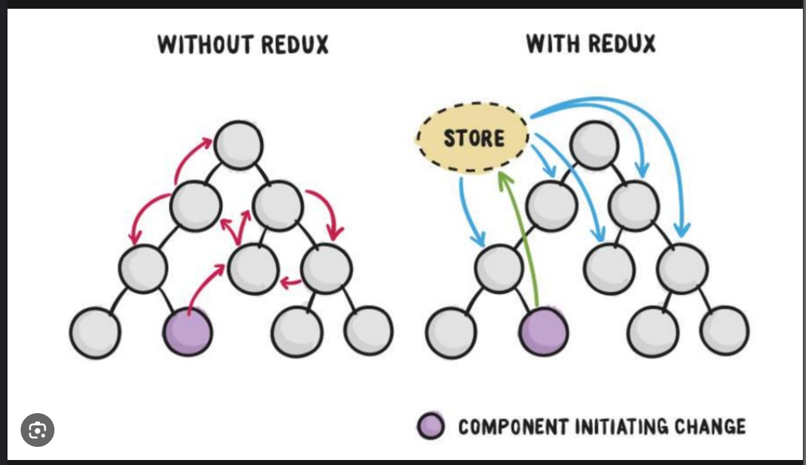

# fake-api

```txt
src
├─components            // 재사용 가능한 컴포넌트 (화면을 구성하는 가장 작은 단위)
│  └─fake-api
│      ├─Cart           // 장바구니
│      ├─Product        // 상품
│      │  └─api         // 데이터를 가져오기 위해 해당 모듈에 필요한 요청을 별도의 js로 작성
│      └─User           // 회원
│          └─api
├─layout
│  ├─Footer
│  └─Navbar
│      └─Sections
├─pages                 // 컴포넌트를 포함하는 상위 컴포넌트 (.jsx)
│  ├─FakeApiPage
│  │  ├─Cart
│  │  ├─Product
│  │  └─User
│  └─LandingPage
└─utils                  
```
FakeApi_Product Page
React를 활용하여 비동기 방식으로 데이터를 핸들링하고 상품 페이지를 구현해보고자 함. 이때, api는 Fake Store API(임의로 개발한 API 에 대해 고정된 응답값을 보내주는 테스트용 API)를 활용하였음.

1. 사용된 라이브러리
    - react 18.2
    - axios 1.5
    - MUI (Material UI) 5.14

1-1. MUI 사용 이유
: 다양한 컴포넌트와 레퍼런스가 있어서 빠르게 적용하여 사용할 수 있을 것 같다고 판단함.

2. 주요기능
    1) 상품 조회
        - 전체 조회 (진입 시, ALL 탭 클릭시)
        - 카테고리 별 조회 (카태고리 탭 클릭시 조회)
    2) 상품명 검색
        - 상품명 검색 시 해당 제품 필터링
        - 검색창에 검색어 입력 후 카테고리 클릭시 카테고리별 해당 제품 조회 가능
    3) 상품 상세보기
        - 상품 정보 조회 (분류, 타이틀, 이미지, 가격)
        - 수량 +/- 추가


3. 컴포넌트 구성



    1) ProductPage ... index.jsx 
    - 상품 페이지를 구성하는 메인 컴포넌트. 
    -  검색창, 카테고리 메뉴탭, 상품 리스트로 구성되어 상품 조회 결과를 보여줌.
    -  검색 또는 카테고리 탭 클릭에 따라 filter한 데이터와 이벤트를 Props로 각 컴포넌트에 전달함.
      

    2) SearchBar ... SearchBar.jsx
    - 검색창과 관련된 컴포넌트 
    - ProductPage 컴포넌트로부터 검색어와 검색어 감지 이벤트를 Props로 전달받아 이용함.
     

    3) ProductCategoryMenu ... ProductCategoryMenu.jsx
    - 카테고리 메뉴탭과 관련된 컴포넌트.
    - ProductPage 컴포넌트로부터 Onclick 이벤트 Props로 받아 이용함
    

    4) ProductList ... ProductList.jsx
    - 상품 리스트와 관련된 컴포넌트.
    - Productpage 컴포넌트로부터 상품리스트를 Props로 받아 이용함
    - 상품명을 클릭하면 상품 상세(ProductDetail)로 이동함     

    5) ProductDetail... ProductDetail.jsx 
    - 상품 상세 페이지 컴포넌트.
    - 2)~4)와 달리 개별적인 컴포넌트로 페이지를 이동하여 데이터가 렌더링됨.
    - ProductInfo에 상품상세 정보를 Props로 전달함    

    6) ProductInfo.. ProductInfo.jsx
    - 상품 상세 데이터를 보여주는 컴포넌트
    - ProductDetail 컴포넌트로부터 전달받은 상품 상세 정보를 보여줌.
    - state와 이벤트를 이용하여 수량 +/-가 버튼 클릭에 따라 즉각적으로 보여짐. 

4. 느낀점
    - 컴포넌트 간의 관계와 독립적으로 다루어야 할 컴포넌트에 대한 이해가 필요하다는 생각이 들었음.
    - Props 관리의 용이함을 위해서 Recoil이나 Redux 사용이 반드시 필요하다는 생각을 함.

# Props Drilling
